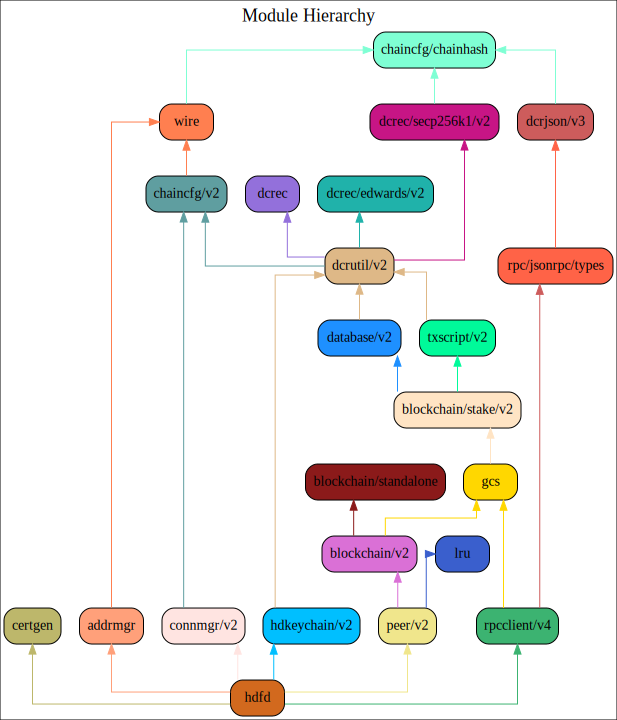

### Table of Contents
1. [About](#About)
2. [Getting Started](#GettingStarted)
    1. [Installation](#Installation)
    2. [Configuration](#Configuration)
    3. [Controlling and Querying hdfd via hdfctl](#HdfctlConfig)
    4. [Mining](#Mining)
3. [Help](#Help)
    1. [Network Configuration](#NetworkConfig)
    2. [Wallet](#Wallet)
4. [Contact](#Contact)
    1. [Community](#ContactCommunity)
5. [Developer Resources](#DeveloperResources)
    1. [Code Contribution Guidelines](#ContributionGuidelines)
    2. [JSON-RPC Reference](#JSONRPCReference)
    3. [Go Modules](#GoModules)
    4. [Module Hierarchy](#ModuleHierarchy)

<a name="About" />

### 1. About

hdfd is a full node Hdfchain implementation written in [Go](https://golang.org),
and is licensed under the [copyfree](http://www.copyfree.org) ISC License.

This software is currently under active development.  It is extremely stable and
has been in production use since February 2016.

It also properly relays newly mined blocks, maintains a transaction pool, and
relays individual transactions that have not yet made it into a block.  It
ensures all individual transactions admitted to the pool follow the rules
required into the block chain and also includes the vast majority of the more
strict checks which filter transactions based on miner requirements ("standard"
transactions).

<a name="GettingStarted" />

### 2. Getting Started

<a name="Installation" />

**2.1 Installation**<br />

The first step is to install hdfd.  The installation instructions can be found
[here](https://github.com/hdfchain/hdfd/tree/master/README.md#Installation).

<a name="Configuration" />

**2.2 Configuration**<br />

hdfd has a number of [configuration](https://godoc.org/github.com/hdfchain/hdfd)
options, which can be viewed by running: `$ hdfd --help`.

<a name="HdfctlConfig" />

**2.3 Controlling and Querying hdfd via hdfctl**<br />

hdfctl is a command line utility that can be used to both control and query hdfd
via [RPC](https://www.wikipedia.org/wiki/Remote_procedure_call).  hdfd does
**not** enable its RPC server by default;  You must configure at minimum both an
RPC username and password or both an RPC limited username and password:

* hdfd.conf configuration file
```
[Application Options]
rpcuser=myuser
rpcpass=SomeDecentp4ssw0rd
rpclimituser=mylimituser
rpclimitpass=Limitedp4ssw0rd
```
* hdfctl.conf configuration file
```
[Application Options]
rpcuser=myuser
rpcpass=SomeDecentp4ssw0rd
```
OR
```
[Application Options]
rpclimituser=mylimituser
rpclimitpass=Limitedp4ssw0rd
```
For a list of available options, run: `$ hdfctl --help`

<a name="Mining" />

**2.4 Mining**<br />
hdfd supports the [getwork](https://github.com/hdfchain/hdfd/tree/master/docs/json_rpc_api.mediawiki#getwork)
RPC.  The limited user cannot access this RPC.<br />

**1. Add the payment addresses with the `miningaddr` option.**<br />

```
[Application Options]
rpcuser=myuser
rpcpass=SomeDecentp4ssw0rd
miningaddr=DsExampleAddress1
miningaddr=DsExampleAddress2
```

**2. Add hdfd's RPC TLS certificate to system Certificate Authority list.**<br />

`cgminer` uses [curl](https://curl.haxx.se/) to fetch data from the RPC server.
Since curl validates the certificate by default, we must install the `hdfd` RPC
certificate into the default system Certificate Authority list.

**Ubuntu**<br />

1. Copy rpc.cert to /usr/share/ca-certificates: `# cp /home/user/.hdfd/rpc.cert /usr/share/ca-certificates/hdfd.crt`<br />
2. Add hdfd.crt to /etc/ca-certificates.conf: `# echo hdfd.crt >> /etc/ca-certificates.conf`<br />
3. Update the CA certificate list: `# update-ca-certificates`<br />

**3. Set your mining software url to use https.**<br />

`$ cgminer -o https://127.0.0.1:9109 -u rpcuser -p rpcpassword`

<a name="Help" />

### 3. Help

<a name="NetworkConfig" />

**3.1 Network Configuration**<br />
* [What Ports Are Used by Default?](https://github.com/hdfchain/hdfd/tree/master/docs/default_ports.md)
* [How To Listen on Specific Interfaces](https://github.com/hdfchain/hdfd/tree/master/docs/configure_peer_server_listen_interfaces.md)
* [How To Configure RPC Server to Listen on Specific Interfaces](https://github.com/hdfchain/hdfd/tree/master/docs/configure_rpc_server_listen_interfaces.md)
* [Configuring hdfd with Tor](https://github.com/hdfchain/hdfd/tree/master/docs/configuring_tor.md)

<a name="Wallet" />

**3.2 Wallet**<br />

hdfd was intentionally developed without an integrated wallet for security
reasons.  Please see [hdfwallet](https://github.com/hdfchain/hdfwallet) for more
information.

<a name="Contact" />

### 4. Contact

<a name="ContactCommunity" />

**4.1 Community**<br />

If you have any further questions you can find us at:

https://clkj.ltd/community

<a name="DeveloperResources" />

### 5. Developer Resources

<a name="ContributionGuidelines" />

**5.1 Code Contribution Guidelines**

* [Code Contribution Guidelines](https://github.com/hdfchain/hdfd/tree/master/docs/code_contribution_guidelines.md)

<a name="JSONRPCReference" />

**5.2 JSON-RPC Reference**

* [JSON-RPC Reference](https://github.com/hdfchain/hdfd/tree/master/docs/json_rpc_api.mediawiki)
* [RPC Examples](https://github.com/hdfchain/hdfd/tree/master/docs/json_rpc_api.mediawiki#8-example-code)

<a name="GoModules" />

**5.3 Go Modules**

The following versioned modules are provided by hdfd repository:

* [rpcclient/v4](https://github.com/hdfchain/hdfd/tree/master/rpcclient) - Implements
  a robust and easy to use Websocket-enabled Hdfchain JSON-RPC client
* [dcrjson/v3](https://github.com/hdfchain/hdfd/tree/master/dcrjson) - Provides
  infrastructure for working with Hdfchain JSON-RPC APIs
* [rpc/jsonrpc/types](https://github.com/hdfchain/hdfd/tree/master/rpc/jsonrpc/types) -
  Provides concrete types via dcrjson for the chain server JSON-RPC commands,
  return values, and notifications
* [wire](https://github.com/hdfchain/hdfd/tree/master/wire) - Implements the
  Hdfchain wire protocol
* [peer/v2](https://github.com/hdfchain/hdfd/tree/master/peer) - Provides a common
  base for creating and managing Hdfchain network peers
* [blockchain/v2](https://github.com/hdfchain/hdfd/tree/master/blockchain) -
  Implements Hdfchain block handling and chain selection rules
  * [stake/v2](https://github.com/hdfchain/hdfd/tree/master/blockchain/stake) -
    Provides an API for working with stake transactions and other portions
    related to the Proof-of-Stake (PoS) system
  * [standalone](https://github.com/hdfchain/hdfd/tree/master/blockchain/standalone) -
    Provides standalone functions useful for working with the Hdfchain blockchain
    consensus rules
* [txscript/v2](https://github.com/hdfchain/hdfd/tree/master/txscript) -
  Implements the Hdfchain transaction scripting language
* [dcrec](https://github.com/hdfchain/hdfd/tree/master/dcrec) - Provides constants
  for the supported cryptographic signatures supported by Hdfchain scripts
  * [secp256k1/v2](https://github.com/hdfchain/hdfd/tree/master/dcrec/secp256k1) -
    Implements the secp256k1 elliptic curve
  * [edwards/v2](https://github.com/hdfchain/hdfd/tree/master/dcrec/edwards) -
    Implements the edwards25519 twisted Edwards curve
* [database/v2](https://github.com/hdfchain/hdfd/tree/master/database) -
  Provides a database interface for the Hdfchain block chain
* [mempool/v3](https://github.com/hdfchain/hdfd/tree/master/mempool) - Provides a
  policy-enforced pool of unmined Hdfchain transactions
* [dcrutil/v2](https://github.com/hdfchain/hdfd/tree/master/dcrutil) - Provides
  Hdfchain-specific convenience functions and types
* [chaincfg/v2](https://github.com/hdfchain/hdfd/tree/master/chaincfg) - Defines
  chain configuration parameters for the standard Hdfchain networks and allows
  callers to define their own custom Hdfchain networks for testing puproses
  * [chainhash](https://github.com/hdfchain/hdfd/tree/master/chaincfg/chainhash) -
    Provides a generic hash type and associated functions that allows the
    specific hash algorithm to be abstracted
* [certgen](https://github.com/hdfchain/hdfd/tree/master/certgen) - Provides a
  function for creating a new TLS certificate key pair, typically used for
  encrypting RPC and websocket communications
* [addrmgr](https://github.com/hdfchain/hdfd/tree/master/addrmgr) - Provides a
  concurrency safe Hdfchain network address manager
* [connmgr/v2](https://github.com/hdfchain/hdfd/tree/master/connmgr) - Implements
  a generic Hdfchain network connection manager
* [hdkeychain/v2](https://github.com/hdfchain/hdfd/tree/master/hdkeychain) -
  Provides an API for working with  Hdfchain hierarchical deterministic extended
  keys
* [gcs](https://github.com/hdfchain/hdfd/tree/master/gcs) - Provides an API for
  building and using Golomb-coded set filters useful for light clients such as
  SPV wallets
* [fees](https://github.com/hdfchain/hdfd/tree/master/fees) - Provides methods for
  tracking and estimating fee rates for new transactions to be mined into the
  network
* [lru](https://github.com/hdfchain/hdfd/tree/master/lru) - Implements a generic
  concurrent safe least-recently-used cache with near O(1) perf

<a name="ModuleHierarchy" />

**5.4 Module Hierarchy**

The following diagram shows an overview of the hierarchy for the modules
provided by the hdfd repository.


